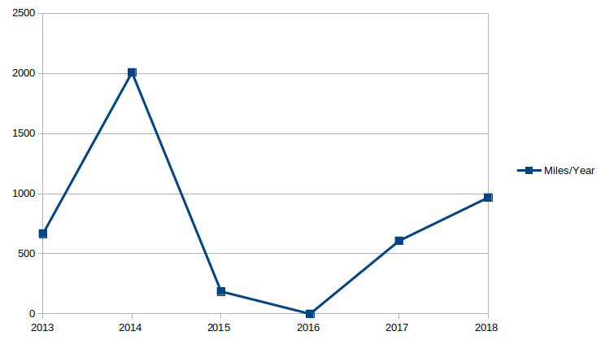
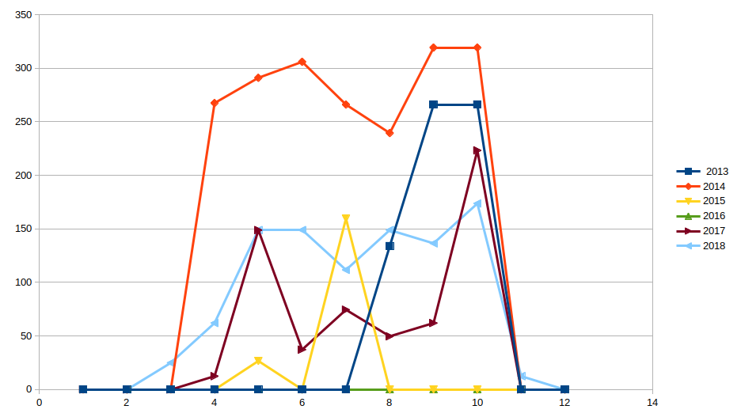

animatedb.github.com
====================

<h3>Car Gallons per Year</h3>

<h3>Car Miles per Year</h3>

<h3></h3>
<h3>Bike Miles per Year</h3>

<h3>Bike Miles per Month</h3>

<h3>Car Winter Mileage</h3>
Winter mileage is lower than summer.

